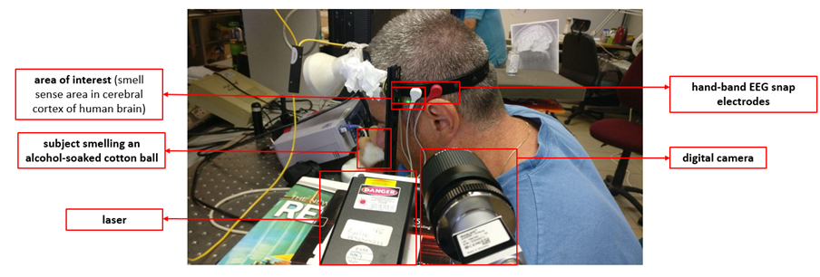

# Senses-speckle
[Remote photonic sensing of blood oxygen saturation via tracking of anomalies in micro-saccades patterns]() paper Python implementation

### Abstract
A novel photonic method is presented for remote monitoring of human senses. Physiological processes associated with hemodynamic activity due to activation of the cerebral cortex of human brain affected by different senses were detected by remote monitoring of nano‐vibrations generated due to the flow of blood to the relevant regions of the brain. Sensing was done by applying temporal-spatial analysis of defocused self‐interference random speckle patterns combined with a novel deep learning approach. The results were compared with human brain signals registered in parallel by electroencephalography (EEG).

### Experimental setup  

### Model